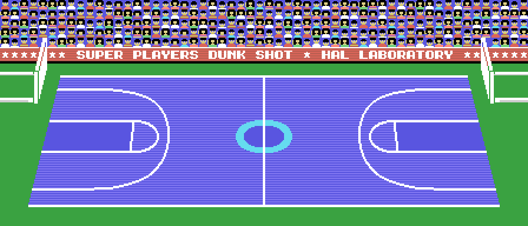
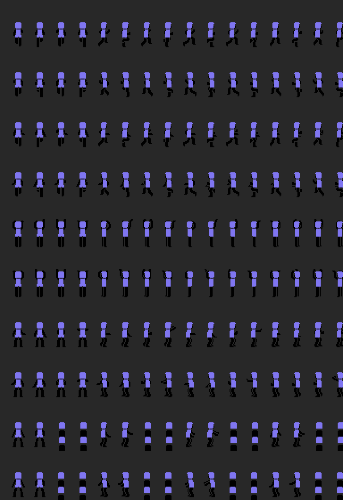
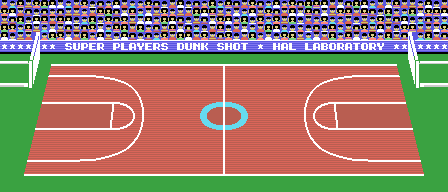

# Findings

What you cannot see by playing, with the address where it is and how it was
measured.

## The court is 56 columns wide and is seen through a 32-column window

The whole court, with the stands and the SUPER PLAYERS DUNK SHOT * HAL
LABORATORY banner, is a 56 × 24 map of patterns compressed at `0xB69E` (714
bytes giving 1,344). There is no hardware scrolling: `0x5F33` copies into the
name table, row by row, the 32 columns starting at the one in 0xE830 (0 to
24), and `0x5E7C` moves it one column at a time when the ball crosses the
centre. The 21 × 4 scoreboard (`0x77AB`) goes on top, at column 6.

Measured by building the window at column 12 and checking it against two
dumps of the match: 0 differences in names, patterns and colours.

## Every player is four sprites, hence the flicker

Hair, upper skin, shirt and lower skin: four 16 × 16 sprites per player, six
players, plus the net, the ball, its shadow and the arrow. The TMS9918 only
draws four sprites per line, so `0x5E1B` sorts the seven groups by depth, `0x5C0B`
builds them in that order, `0x5BAB` copies them reversed as well, and the two
orders go to two attribute tables (0x1B00 and 0x1F00) that register 5
alternates every frame (`0x5B77`): one frame the near players are in front,
the next the far ones. The flicker is deliberate. On an MSX2, with eight
sprites per line, [a 164-byte patch](THE-MSX2-PATCH.md) brings it down from
66.7 sprites not drawn per frame to 1.7.

In the dumps, the 24 player sprites appear in a different order in the two
tables, and the one shown is the one bit 2 of register 5 points at.

## The 160 poses and the 32 looks

A pose is four pattern numbers (`0xA4CE`) and four offsets (`0xA38E`, one per
group of four poses) that `0x5C40` subtracts from the position of the feet;
the 196 patterns live in RAM, decompressed from `0x9725`, `0x9B08`, `0x9F80`
and `0xA360`. Each player's look is one of the 32 pairs at `0x80E4` (skin
0x0B, 0x0A or 0x01 and eleven hair colours) and the shirt is the team colour
(0xEA2C/0xEA5C).

Pose, patterns and colours are checked on the six players of two openMSX
dumps: for each one, the four sprites in the attribute table give the same
foot position once their offsets are added back, carry the colours
skin-skin-hair-shirt, and their patterns in VRAM are those of the pose.

## Computer teams are generated by level

ELM, JNR, HIG, COL, YUG, ESP, USA and PRO are not stored rosters: they are
levels 1 to 8. When one is chosen, `0x72CA` generates eight players with 30,
20 and 25 skill points plus 30 for each level above the first, and a random
look taken from the Z80's R register. The name is copied from the list at
`0x7CA1` and the level is kept in byte 3 of the team.

## Teams are saved to tape as a BSAVE

SAVE DATA writes the team block (0xEC bytes: name, level, colour and eight
29-byte players) with the cassette BIOS, using the binary header, ten 0xD0
bytes, and a six-letter name: the team's three letters and three 0x7F
(`0x8C33`). LOAD DATA finds and reads it (`0x8C71`) and VERIFY compares it
byte for byte (`0x8C87`). With no tape, the message is ERROR!

## Three courts, one colour table each

COLOR OF COURT chooses between three compressed colour tables (`0xABA8`,
`0xACB0` and `0xADB8`: 264 bytes each, 2,000 when decompressed) for the same
250 patterns. Green, blue and red; the stands and the banner do not change.

## The computer's plays

The 720-byte table at `0xAF5F` is five formations with six variants each, and
in every variant an eight-byte script per player: a delay and waypoints (Y,
X, code) up to a 0x80. `0x6F48` picks the variant from the current formation
and a random bit, and button 2 of the team with the ball in the opponent's
half moves on to the next one.

## What is never drawn and what nobody runs

Three court patterns (0x73, 0x85 and 0x86) and the E and S of an ESC in the
logo's pattern set (0xFB, 0xFC) are never shown; the C (0xFD) is, in the
title. One sprite pattern, number 195, is used by no pose.

And seventeen pieces of code nobody reaches: alternative entries, a
five-digit counter (`0x7AAE`) and a routine that writes a zero into the ROM
itself (`0x8B3C`), from when the program ran in RAM.

At `0x4EEC`, besides, everything points to a bug in the original: it loads
`ld hl,(0xE6DF)` where the surrounding code suggests `ld hl,0xE6DF`, and
compares and writes at the address formed by "who shot" and "left jumper",
which is 0xFFFF at start-up. What it does is measured in the listing; what it
was meant to do is not.
