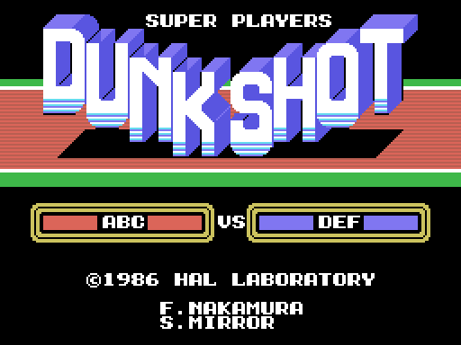

# In the emulator

The checks were made with openMSX and the C-BIOS_MSX1_JP machine. The script
`tools/omsx_vuelca.tcl` presses the keys it is told at the seconds it is told
and dumps the whole VRAM, the RAM from 0xC000 up and the VDP registers;
`tools/lanza_vuelca.sh` launches it:

    sh tools/lanza_vuelca.sh work/v_titulo "6 12"
    sh tools/lanza_vuelca.sh work/v_partido2 "16 20 25 30 45" "4 8 0x01 8 8 0x01 12 8 0x01"
    sh tools/lanza_vuelca.sh work/v_menus "12 19 26" "4 8 0x01 7 8 0x40 9 8 0x01 14 8 0x40 16 8 0x01"

Keys go as `second row mask` of the keyboard matrix: space is row 8 with
0x01 and down is row 8 with 0x40. Space at seconds 4, 8 and 12 takes you from
the title to the menu, from there to SET-UP and from there to the match.

Then `tools/coteja.py` compares the built VRAM with the dump: the name table
and, for each third, the pattern and colour of the tiles in use. What is left
in VRAM from earlier screens and not used does not count.

    python3 tools/coteja.py work/partido_12.vram work/v_partido2/t020.vram work/v_partido2/t020.regs

## What was checked

At 0 differences: the title (two dumps), the first menu, SET-UP, the team
card, LOAD DATA with SURE? and with ERROR!, and the match at the tip-off (two
dumps, with the window at column 12). And the 24 sprites of the six players in
those two dumps: pose, patterns, colours and the foot position that follows
from the four offsets.

The dumps do not travel with the repository; what travels is the sha256 of
each built VRAM (`tests/test_juego.py`), so that a change in the decompressors
or in the build shows up in the tests.
