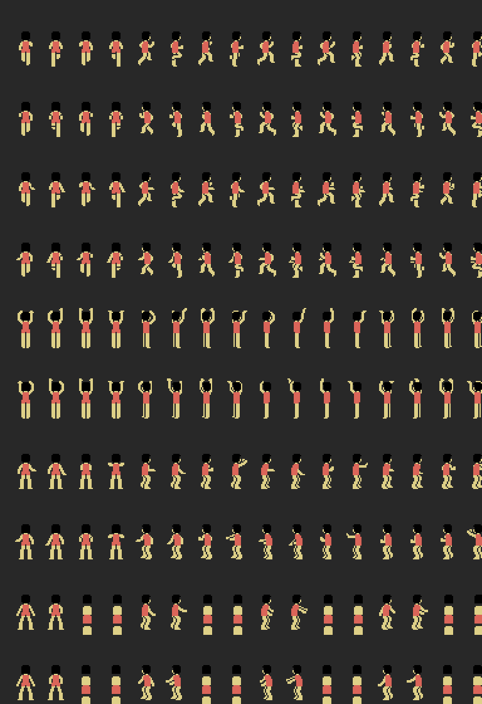

# The code

## Start-up and the loop

INIT (`0x4010`) sets the stack at 0xF200, enables the slot in page 2, hooks
the frame interrupt to `0x606E` and starts: `0x5189` clears the RAM, `0x501F`
sets SCREEN 2 and loads patterns, sprites and colours, `0x7322` leaves the
teams ABC and DEF, and the loop at `0x4044` chains title (`0x839C`), wait
(`0x8B28`), menu (`0x83BA`), SET-UP (`0x812F`) and match. The interrupt
handles the players' turning, the falls, the net and the buttons
(`0x60A0`-`0x62E3`).

## The sprites and the flicker

Every frame, `0x5C40` works out each player's four sprites: it subtracts the
pose offsets (`0xA38E`) from the position of the feet and adjusts the height
with the perspective curves at `0xB59E` and `0xB61E` (`0x5DE4`, `0x5DAF`).
Since the TMS9918 draws no more than four sprites per line, `0x5E1B` sorts the
seven groups (six players and the fixed ones) by depth, the nearest first,
`0x5C0B` builds their attributes in that order, `0x5BAB` copies them reversed
into another buffer and the two go to the two attribute tables (0x1B00,
0x1F00); `0x5B77` flips bit 2 of register 5 every frame to show one or the
other: one frame the near players are in front, the next the far ones. That is what makes the players flicker
when they bunch up. On an MSX2 the V9938 draws eight per line: [The MSX2
patch](THE-MSX2-PATCH.md) takes the game there, measured before and after.

## The window over the court

The 56 × 24 map is in RAM (0xC400, decompressed by `0x5F8D`). `0x5F33` copies
into the name table the 24 rows of 32 bytes starting at the column in 0xE830,
with `0x5B07` (SETWRT and `outi`); `0x5E7C` decides when to move it. There is
no fine scrolling: the screen jumps one column at a time.

## Drawing into VRAM

Three routines do it all: `0x5B07` writes BC bytes from HL to DE, `0x5B50`
fills BC bytes with A and `0x5AF7` writes one byte at HL. On top of them go
`0x7C1B` (a zero-terminated string), `0x7C29` (B rows of C characters),
`0x7FC1` (a box with patterns 0xF5-0xF7 and 0x62-0x67) and the number
printers at `0x7ACF`, `0x7ADA` and `0x7AA7`, which blank the leading zeros by
counting in C the digits already written.

## The menu selector

`0x8AC9` takes the cursor position, the number of options and the ball
pattern (0x6F); it reads with CHGET, moves up and down with 0x1E and 0x1F and
returns any other key. The chosen option lives in 0xEFCD, whose bit 7 says
whether the right-hand team is being dealt with.

## The computer

With the ball, `0xBB14` takes the player through five states (0xF009): pick a
point towards the basket with sine and cosine from the tables at 0xC000, run
to it, face the basket, go to the shooting spot and shoot, steal or pass
according to chance and the +0x1D and +0x1E skills. Without the ball, `0xBD61`
(0xF00A) goes for the ball carrier, marks him or stays put, and `0x76AE`
measures the shooting zone. The plays at 0xEA89 give each player a script of
waypoints to go to.

## The sound

`0x8D42` starts piece A if its priority (`0x8F71`) is not lower than the one
playing; `0x8D8B` runs every frame and `0x8DB2` interprets: 0x40-0xFF note
(channel in the two high bits, index into the table of 64 periods), 0x20-0x25
mixer, 0x26-0x2F register, 0x33 jump, 0x34/0x35 call and return with its own
stack in IX, 0x36/0x37 loop, 0x38-0x3B relative volume, 0x3D silence,
0x00-0x1F wait; a wait of zero ends the piece. Thirteen pieces, ten distinct:
the music is piece 1 (and 8, the same pointer) and 4, 5 and 6 are the same one
with three priorities.

## Chance

The Z80's R register (`0x50E9`, `0x6F53`, `0x6F76`): one bit or one byte, as
needed.

## What nobody runs

Seventeen pieces of code with no callers, declared in `src/dunkshot.entries`
with their reason: alternative entries (`0x59BA`, `0x59E8`, `0x5AFD`), loose
routines (`0x441D` negates HL, `0x6F76` gives 1 or 2 at random, `0x8D3B` waits
for the sound to end), a five-digit counter (`0x7AAE`) and `0x8B3C`, which
writes a zero at 0x785B, which is ROM: a leftover from when the program was
tested in RAM.
