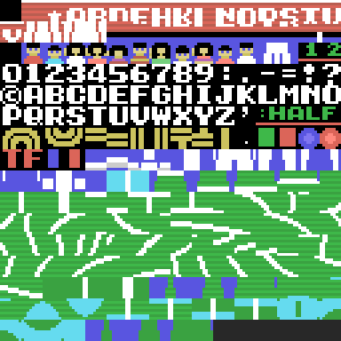
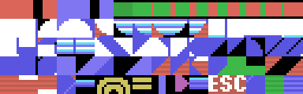
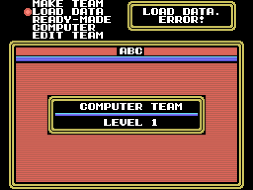

# El cartucho

32 KB sin mapeador en las páginas 1 y 2 (0x4000-0xBFFF), cabecera `AB` con
INIT en `0x4010` y los otros tres punteros a cero. INIT activa la ranura en la
página 2, engancha H.TIMI a `0x606E` y entra en el bucle de `0x4044`.

## Qué hay dentro

| rango | qué es |
|---|---|
| 0x4010-0x8ED4 | código (20.642 bytes en total, con el tramo final) |
| 0x8ED5-0x8F7D | el sonido: 64 periodos, el mezclador, 13 punteros y 13 prioridades |
| 0x8F7E-0x9664 | las piezas de sonido y sus frases compartidas |
| 0x9665-0x9724 | la red y el balón, seis patrones de sprite |
| 0x9725-0xA38D | 196 patrones de sprite de los jugadores, comprimidos |
| 0xA38E-0xA74D | las poses: 40 colocaciones y 160 poses |
| 0xA74E-0xABA7 | los 250 patrones de la pista, los menús y la fuente |
| 0xABA8-0xAEBF | tres tablas de color, una por pista |
| 0xAEC0-0xB967 | colores, jugadas, tablas de nombres, el logotipo y el mapa de la pista |
| 0xB968-0xBFD3 | código: mandos, despachador y la inteligencia de la máquina |
| 0xBFD4-0xBFFF | 44 bytes a 0xFF |

Y repartidas por el código, las tablas pequeñas: los textos (`0x7C55`), los
rótulos de falta (`0x796F`), las parejas de aspecto (`0x80E4`), las posiciones
del saque (`0x5255`), las direcciones (`0x693D`, `0xBA7B`) y los compañeros
(`0xBF1E`).

## Cuatro compresores

- **0x52CF**, el general: cabecera de máscara y valor; una ficha de control
  repite el byte siguiente o copia ocho bytes de lo ya escrito (un
  diccionario sobre el propio destino, con los bits dados la vuelta si se
  pide). Sprites, pista, logotipo, jugadas.
- **0x5331**, solo repeticiones: tablas de nombres, el marcador y el mapa de la
  pista.
- **0x535B**: una marca y `marca valor cuenta`. Los colores de 0x2100.
- **0x5373**: parejas de bytes repetidas. Las tres tablas de color.

Cada bloque acaba justo donde empieza el siguiente y mide lo que el código
copia después; lo comprueban los tests.

## La VRAM

SCREEN 2 tal como la deja INIGRP: patrones en 0x0000 (los 250 de la pista en
los tres tercios y el logotipo en 0xB0-0xFF), nombres en 0x1800, atributos de
sprite en 0x1B00 y 0x1F00, colores en 0x2000 (la tabla de la pista elegida en
los tres tercios, con 0xAEC0 encima en 0x2100) y patrones de sprite en 0x3800:
cada jugador tiene cuatro en 0x3800 + n × 128 que `0x5FD1` copia desde la RAM
cuando cambia de pose; la red en 0x3B00 y el balón, la sombra y la flecha en
0x3B60.

## La RAM

Seis registros de jugador de 0x30 bytes en 0xE500 (`0x4DBF` los indexa; +1 es
la Y, la profundidad, y +3 la X a lo largo de la pista con signo desde el
centro), el balón en 0xE620, la sombra de los atributos de sprite en 0xE650,
los dos equipos en 0xE851 y 0xE93D, las jugadas en 0xEA89, las variables del
sonido en 0xEFE1-0xEFE8 y la columna de la ventana en 0xE830. En 0xC000-0xC2FF
están las tablas de perspectiva que `0x5A58` monta al arrancar el partido, y
0xC400 es el búfer donde se descomprime todo.

## La cinta

Un equipo se graba como un bloque BSAVE: la BIOS de casete escribe diez 0xD0 y
un nombre de seis letras (las tres del equipo y tres 0x7F), después las
direcciones de inicio, fin y ejecución y los 0xEC bytes del equipo
(`0x8C33`). La carga (`0x8C71`) busca una cabecera cuyo nombre acabe en esos
tres 0x7F y VERIFY (`0x8C87`) compara byte a byte.

