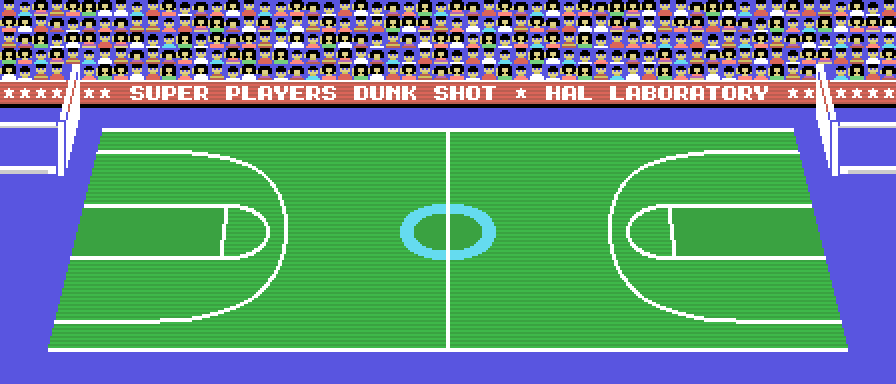
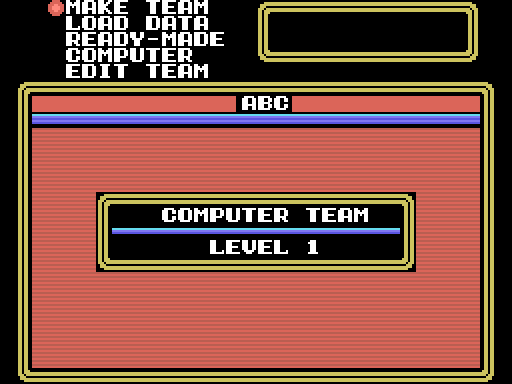
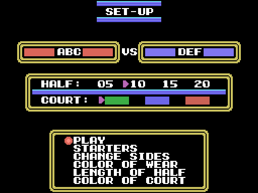
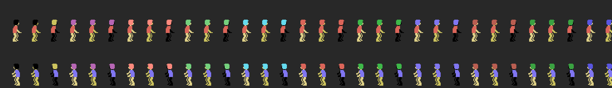
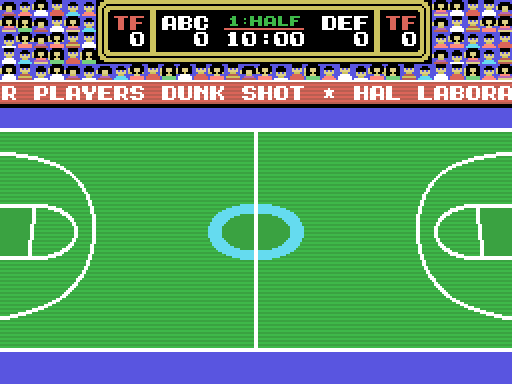

# El juego

Dunk Shot es baloncesto de **tres contra tres** visto desde la grada: una
pista que mide casi el doble que la pantalla, dos equipos de tres jugadores
en pista (de una plantilla de ocho) y un partido a dos mitades de 5, 10, 15 o
20 minutos.

## Los menús

Del título se pasa con espacio al primer menú: **SET-UP**, **LEFT TEAM**,
**RIGHT TEAM** y **TRADE**. Si no se toca nada, a los 1.500 cuadros (`0x405E`)
arranca la demostración.

Las dos pantallas de equipo tienen MAKE TEAM (nombre de tres letras y ocho
jugadores de ocho letras), LOAD DATA, READY-MADE, COMPUTER (los ocho equipos
de la máquina) y EDIT TEAM, con STARTERS para elegir los tres titulares y
SAVE DATA y VERIFY para la cinta. TRADE intercambia jugadores entre los dos
equipos.

SET-UP tiene PLAY, STARTERS, CHANGE SIDES, COLOR OF WEAR, LENGTH OF HALF (5,
10, 15 o 20 minutos: `0x73A3` multiplica por 300 segundos) y COLOR OF COURT,
las tres pistas. Al arrancar los dos equipos son de la máquina: con PLAY el
partido se juega solo.

## Los equipos

Un jugador ocupa 29 bytes (`0x7E2E` devuelve el campo que se le pida): ocho
letras de nombre, el aspecto (0-31, una de las 32 parejas de piel y pelo de
`0x80E4`) y las habilidades, que la pantalla de estadísticas rotula **S**,
**J** y **R**. Un equipo son 0xEC bytes: tres letras, el nivel, el color y los
ocho jugadores.

Los ocho equipos de la máquina, ELM, JNR, HIG, COL, YUG, ESP, USA y PRO, son
los niveles 1 a 8: `0x72CA` genera sus jugadores con 30, 20 y 25 puntos más 30
por cada nivel por encima del primero, y el aspecto al azar. Ese bloque de
0xEC bytes es lo que SAVE DATA graba en cinta y lo que TRADE intercambia
(`0x8201`).

## El partido

Seis jugadores en pista, cada uno con sus dos compañeros fijos (`0xBF1E`), el
balón y la red. La pista entera son 56 columnas (`0xB69E`); la pantalla enseña
32 y salta de columna en columna (`0x5F33`, `0x5E7C`). Arriba, el marcador:
nombres, faltas de equipo (TF), puntos, tiempo y mitad.

La canasta vale 2 dentro de la zona y a media distancia, 3 a cuarenta o más
de la canasta y 1 el tiro libre (`0x772E`); tres segundos en la botella (210
cuadros, `0x76EA`) son 3 SECOND.

Las faltas y violaciones que pita el juego son las doce de `0x796F`:
TRAVELLING, 3, 5, 10 y 30 SECOND, CHARGING, HACKING, HOLDING, PUSHING y
BLOCKING, más los dos rótulos del contador. La pantalla de estadísticas
lleva, por jugador, FOULS y FATIGUE. Al descanso, HALF TIME; al final, GAME
OVER y PUSH ANY KEY (`0x8BF3`, `0x8C21`).

## Los mandos

Leído del código (`0xB9C3` y `0xBA16`): el equipo humano de la izquierda usa
el joystick 1 o, si no da nada, los cursores con `[` como tiro y RETURN como
pase; el de la derecha, el joystick 2 o cuatro teclas de las filas 3 y 5 de la
matriz del teclado con TAB y CTRL. El botón 2 del equipo con balón en campo
contrario cambia de jugada; el del equipo sin balón cambia de defensor
(`0x622A`, `0x627F`). Los menús van con los cursores, espacio y ESC.
